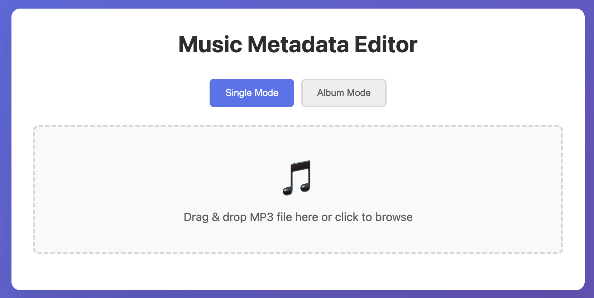

# MusicAlbumUtils

## Why I Built This

I got really tired of subscription music apps. They're expensive, they keep changing their libraries, and I never really felt like the music was mine. So I decided to build something simple to create my own music playlist by downloading tracks and playing them offline.

But it's more than just downloading. I wanted to make my music collection truly personal. This app helps me edit metadata like song titles, artists, and album names. More importantly, I can replace the default album covers with photos that remind me of special moments, like when I first heard a song or where I was when it became meaningful to me. It's a small thing, but it makes my music library feel uniquely mine.



## What It Does

This is a collection of Python tools that help you:
- Edit music metadata (titles, artists, albums, etc.)
- Replace album cover art with your own images
- Organize and sort your music files

It's nothing fancy, just some scripts I put together to manage my own music collection. Hope it helps you too.

## Requirements

- Python 3.10 or higher

### Dependencies

```bash
pip install eyed3 yt-dlp click xmltodict mutagen flask werkzeug
```

Or install individually:
- `eyed3` - MP3 metadata manipulation
- `yt-dlp` - Video/audio downloading from YouTube and Bilibili
- `click` - Command-line interface creation
- `xmltodict` - XML parsing for iTunes playlists
- `mutagen` - Audio metadata handling
- `flask` - Web interface
- `werkzeug` - Flask utilities
